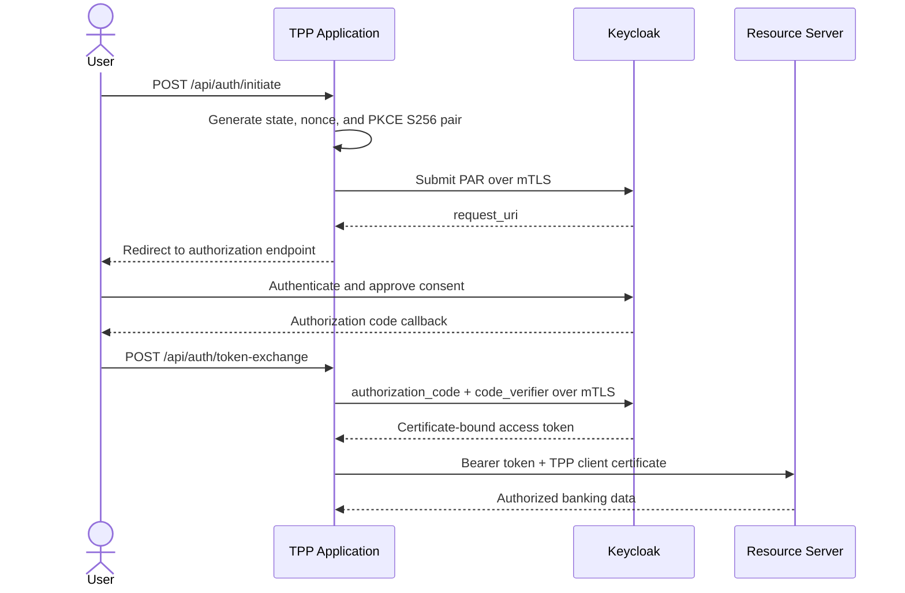

# B0-C0: Traditional FAPI Baseline

## Purpose and boundary

B0-C0 is the centralized three-party comparator. The TPP obtains an OAuth access token from Keycloak and presents it directly to the Resource Server. There is no Wallet, Authorization Credential, Delegation Credential, Verifiable Presentation, or Bank Issuer/DAS service in this baseline.

Repository root: `traditional-fapi/`

## Runtime topology

| Service | Implementation | Container | Host port | Responsibility |
|---|---|---|---|---|
| PostgreSQL | PostgreSQL 15 Alpine | `postgres-fapi` | Internal | Keycloak persistence |
| Authorization Server | Keycloak 24.0.5 | `keycloak-fapi` | 8443 HTTPS; 8080 HTTP | Login, consent, PAR, authorization code, and token issuance |
| Resource Server | Node.js/Express | `resource-server-fapi` | 4000 HTTPS | JWT validation, scope enforcement, and Berka data access |
| TPP Application | Node.js/Express | `tpp-fapi` | 3000 HTTPS | Browser UI, OAuth client, token storage, and banking API proxy |

Single-host deployment uses `traditional-fapi/docker-compose.yml`. Split deployment uses `docker-compose.bank.yml` and `docker-compose.tpp.yml`.

## Implemented lifecycle

The TPP stores sessions in an in-memory `Map` keyed by OAuth `state`. Each session holds the verifier, nonce, requested scope, and returned tokens.

### Current PAR behavior

`POST /api/auth/initiate` first attempts PAR. The current source catches PAR errors and can continue with a direct authorization URL. This is implementation behavior, not a conformance endorsement; strict FAPI evaluation must explicitly test and disposition this branch.

## Security profile

| Role | Current implementation |
|---|---|
| Realm default signature | PS256 |
| ID token signature | PS256 |
| Access token signature | PS256 |
| PKCE | S256 |
| Sender constraint | `cnf.x5t#S256` matched to the presented mTLS certificate |
| Token validation | JWKS signature, issuer, audience, expiration through JWT verification, sender constraint, then scope |
| Resource Server audience | `resource-server-client` plus configured URL aliases |

The Compose configuration currently sets `NODE_TLS_REJECT_UNAUTHORIZED=0` for development. Do not interpret this development setting as production certificate-chain verification.

## TPP endpoints

| Endpoint | Purpose |
|---|---|
| `GET /api/config` | Return frontend configuration |
| `POST /api/auth/initiate` | Create OAuth state/nonce/PKCE and initiate PAR/authorization |
| `POST /api/auth/token-exchange` | Validate state and exchange the authorization code |
| `GET /api/session` | Inspect the in-memory session state |
| `POST /api/auth/logout`, `/api/reset`, `/api/auth/reset` | Remove a session |
| `/api/bank/**` | Proxy legacy and Open Banking resource requests to the Resource Server |
| `POST /api/call-banking-api` | Generic authenticated Resource Server call used by the UI/harness |

## Resource Server endpoints

### Open Banking compatibility endpoints

| Method and path | Required scope |
|---|---|
| `GET /open-banking/v3.1/aisp/accounts` | `ReadAccountsDetail` |
| `GET /open-banking/v3.1/aisp/accounts/{id}` | `ReadAccountsDetail` |
| `GET /open-banking/v3.1/aisp/accounts/{id}/balances` | `ReadBalances` |
| `GET /open-banking/v3.1/aisp/accounts/{id}/transactions` | `ReadTransactionsDetail` |
| `POST /open-banking/v3.1/pisp/domestic-payments` | `CreateDomesticPayment` |

### Legacy project endpoints

- Accounts: `GET /api/v1/accounts`, `GET /api/v1/accounts/{id}`
- Transactions: `GET /api/v1/accounts/{id}/transactions`
- Cards and loans: `GET /api/v1/accounts/{id}/cards`, `GET /api/v1/accounts/{id}/loans`
- Transfers: `GET|POST /api/v1/transfers`
- Profile: `GET /api/v1/user/profile`
- Health and metadata: `GET /health`, `GET /api/v1/health`, `GET /api/v1/meta`

## Primary source map

| File | Read when changing |
|---|---|
| `traditional-fapi/docker-compose.yml` | Topology, environment, resource limits, or ports |
| `traditional-fapi/auth-server/realm-config/traditional-fapi-realm.json` | Clients, scopes, token algorithms, audience, PKCE, or users |
| `traditional-fapi/tpp-app/server.js` | Authorization lifecycle, session behavior, or TPP proxy endpoints |
| `traditional-fapi/resource-server/server.js` | Token acceptance, scopes, database queries, or banking endpoints |
| `traditional-fapi/resource-server/berka.db` | Dataset-dependent behavior |
| `traditional-fapi/generate-certs.ps1` and `.sh` | TLS identities and certificate generation |

## Known implementation constraints

- Runtime sessions are in memory and are lost on restart.
- Direct Debits endpoints are not implemented.
- The TPP contains a PAR-to-direct-authorization fallback that requires conformance review.
- Local Compose embeds development credentials and disables Node TLS chain rejection; use isolated test environments only.
- The legacy `traditional-fapi/benchmark/` harness is not the authoritative cross-baseline evaluation runner.
