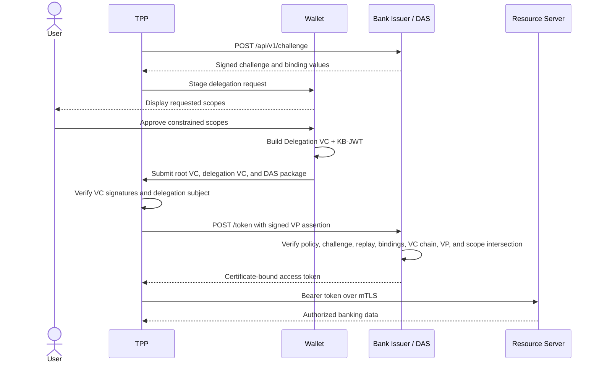

# B1-C0: Classical VDAM Baseline

## Purpose and boundary

B1-C0 is the four-party wallet-mediated authorization baseline using classical application cryptography. The Wallet receives an Authorization Credential from the Bank Issuer, delegates a constrained credential to the TPP after user approval, and the TPP exchanges a signed presentation for a certificate-bound access token.

Repository root: `wallet-vc-model-classical/`

## Runtime topology

| Cluster | Service | Container | Host port | Responsibility |
|---|---|---|---|---|
| Bank | PostgreSQL | `classical_postgres` | Internal | Keycloak persistence |
| Bank | Keycloak | `classical_keycloak` | 8080 | OAuth/OIDC authentication and wallet authorization |
| Bank | Nginx TLS gateway | `classical_tls_server_proxy` | 8443 | Routes `/realms` to Keycloak, issuer paths to Bank Issuer, and resource paths to RS |
| Bank | Bank Issuer/DAS | `classical_bank_issuer` | 7000 | OID4VCI, challenge issuance, VC-chain verification, token issuance, and introspection |
| Bank | Resource Server | `classical_resource_server` | 4000 | Access-token validation, scope enforcement, and Berka data access |
| Wallet | Wallet service | `classical_wallet_java` | 5000 | OAuth/OID4VCI client, credential store, consent, and delegation signing |
| Wallet | Nginx gateway | `classical_wallet_gateway` | 3443 | Browser UI and outbound Bank/TPP routing |
| TPP | TPP service | `classical_tpp_java` | 3000 -> 6001 | Delegation request, credential verification, VP construction, token exchange, and resource calls |
| TPP | Nginx gateway | `classical_tpp_gateway` | 4443 and 6443 | Browser UI, Wallet-facing API, and outbound Bank routing |

The root `docker-compose.yml` includes the Bank, Wallet, and TPP Compose files. The same component files can be deployed separately across VMs.

## Business lifecycle

### Initial mode: obtain the Authorization Credential

1. Wallet fetches or receives an OID4VCI credential offer.
2. Wallet loads issuer metadata and starts an OAuth authorization-code flow using PKCE S256.
3. User authenticates at Keycloak and returns through `/callback`.
4. Wallet exchanges the code and submits a credential proof to `POST /credential`.
5. Bank Issuer creates an `AuthorizationCredential` as SD-JWT and binds it to the Wallet key/certificate record.
6. Wallet stores the credential in its in-memory credential map.

`POST /api/provision-scope-vc` and the issuer's `/api/internal/bootstrap-credential` support controlled development/evaluation provisioning. They must not silently replace the complete initial lifecycle in a full-flow benchmark.

### Repeated mode: delegate and access banking data

The Bank Issuer computes the final token authority from constrained sets, including delegated authority and registered TPP policy. It records consumed JTI/challenge state to reject replay.

## Cryptographic profile

Application signing and transport certificates are separate layers:

| Role | Current implementation |
|---|---|
| Keycloak realm, ID token, and access token | ES256 |
| PKCE | S256 |
| Bank Issuer application key | P-256 / ES256 |
| Wallet application key | P-256 / ES256 |
| TPP application key | P-256 / ES256 |
| Authorization VC, Delegation VC, KB-JWT, VP, Bank-issued access token | ES256 signatures |
| DAS confidential package | ECDH-ES + A256GCM to the Bank P-256 key |
| Sender constraint | `cnf.x5t#S256` |
| Generated TLS certificates | ECDSA P-384 |
| Nginx TLS | TLS 1.2/1.3 with classical EC configuration |

Therefore B1-C0 must be described as P-256/ES256 at the application-signature layer even though its TLS certificate generator uses P-384.

## Component API map

### Bank Issuer/DAS

- Discovery and keys: `GET /.well-known/openid-credential-issuer`, `GET /jwks`, `GET /.well-known/jwks.json`
- Policy: `GET /api/policy/tpp-scopes/{tppClientId}`, `GET /api/policy/master-catalog`, `GET /api/policy/identity-claims`
- Issuance: `GET /offer/{type}`, `POST /credential`, `POST /api/internal/bootstrap-credential`
- Delegated authorization: `POST /api/v1/challenge`, `POST /token`
- Token status: `POST /introspect`
- Health: `GET /health`

### Wallet

- Configuration and keys: `GET /api/config`, `/api/wallet-key`, `/api/jwks`
- OID4VCI: `GET /api/fetch-offer`, `POST /api/receive-offer`, `POST /api/start-auth`, `GET /callback`
- Credential store: `GET /api/vcs`, `DELETE /api/vcs/{jti}`, `POST /api/delete-vc`
- Evaluation provisioning: `POST /api/provision-scope-vc`
- Delegation: `POST /api/delegate-request`, `GET /api/fetch-tpp-request`, `GET /api/delegate-requests`, `GET /api/delegate-status/{requestId}`, `POST /api/approve-delegate`, `GET /api/delegate-vcs/{requestId}`, `POST /api/send-to-tpp`
- Diagnostics: `GET|DELETE /api/protocol-log`

### TPP

- Configuration/policy: `GET /api/config`, `/api/tpp-allowed-scopes`, `/api/tpp-allowed-identity-claims`
- Delegation: `POST /api/request-delegate`, `POST /api/wallet-approve`, `GET /api/public/delegate-request/{requestId}`, `POST /api/public/submit-presentation`, `GET /api/poll-delegate`, `POST /api/receive-vcs`
- State: `GET /api/state`, `GET /api/status`, `POST /api/reset`
- Token and resources: `POST /api/token`, `POST /api/request-token`, `POST /api/call-banking`, `POST /api/call-banking-api`
- Diagnostics: `GET|DELETE /api/protocol-log`

### Resource Server

The Open Banking endpoints and their required scopes match the common list in [the baseline index](./README.md). Legacy `/api` endpoints cover accounts, transactions, cards, loans, transfers, and profile.

The Resource Server accepts locally verified JWTs from either the Bank Issuer or Keycloak, then enforces audience, `cnf.x5t#S256`, and scope. The two issuer-verification branches are current source behavior and must be evaluated explicitly rather than treated as interchangeable evidence.

## State ownership

| Component | In-memory state |
|---|---|
| Wallet | Credential map, OAuth sessions, pending delegation requests, protocol log |
| TPP | Current TPP state, pending requests, protocol log |
| Bank Issuer | Issued access tokens, consumed JTI expirations, pending DAS challenges |
| Resource Server | Cached JWKS handles; persistent business data in SQLite |

State is not durable across service restarts. Concurrency evaluation must verify that request IDs and session contexts prevent cross-talk; the existence of concurrent maps alone is not proof of isolation.

## Primary source map

| Concern | Source |
|---|---|
| Topology | `docker-compose.yml` and `{bank,wallet,tpp}/docker-compose.yml` |
| Realm/profile | `bank/auth_server/realm-config/fapi-demo-realm.json` |
| Issuance and DAS | `bank/bank-issuer/.../IssuerController.java` |
| Bank crypto | `bank/bank-issuer/.../CryptoService.java` |
| Credential-chain validation | `bank/bank-issuer/.../CredentialVerificationService.java` |
| Certificate association | `bank/bank-issuer/.../CertificateRecordStore.java` |
| Authorization policy | `bank/bank-issuer/src/main/resources/authorization-policy.json` |
| Wallet lifecycle | `wallet/wallet-java/.../WalletController.java` |
| TPP lifecycle | `tpp/tpp-java/.../TppController.java` |
| Resource acceptance | `bank/resource-server/server.js` |
| TLS | `*/tls-proxy/*.conf*` and `generate-all-certs.*` |

## Known implementation constraints

- Wallet, TPP, challenge, replay, and issued-token state is memory-resident.
- Direct Debits endpoints are not implemented.
- Some development paths expose direct service ports in addition to gateways.
- Proxy client-certificate mode is configured as optional at the Bank gateway; application-layer sender-constraint checks still reject missing certificates for protected resource calls.
- Full conformance must distinguish normal OID4VCI initialization from evaluation bootstrap endpoints.
