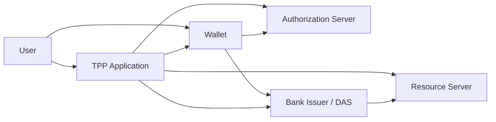

# Baseline Architecture Index

This directory is the source-derived navigation layer for the three evaluation baselines. It records the current implementation, not an idealized protocol and not a conformance result.

| Evaluation ID | Directory | Architecture | Application signature profile | Transport profile | Detailed reference |
|---|---|---|---|---|---|
| B0-C0 | `traditional-fapi/` | Three-party centralized OAuth/FAPI flow | Keycloak PS256 access and ID tokens | Conventional TLS/mTLS | [B0-C0](./B0-C0.md) |
| B1-C0 | `wallet-vc-model-classical/` | Four-party wallet-mediated VDAM flow | P-256 / ES256 for Keycloak, VC, VP, and access-token signatures | Classical TLS; generated certificates are ECDSA P-384 | [B1-C0](./B1-C0.md) |
| B1-C2 | `wallet-vc-model/` | Four-party wallet-mediated VDAM flow | `MLDSA65-ECDSA-P384-SHA512` composite signatures | OQS TLS with `X25519MLKEM768` first in the configured group list | [B1-C2](./B1-C2.md) |

## Shared comparison boundary

B0-C0 uses the User, TPP, Authorization Server, and Resource Server paths. B1-C0 and B1-C2 add the Wallet and Bank Issuer/DAS paths. The two VDAM baselines intentionally share the same business lifecycle; their main comparison variable is the cryptographic profile.

## Common banking API surface

All three Resource Servers expose the current Open Banking compatibility surface:

- `GET /open-banking/v3.1/aisp/accounts`
- `GET /open-banking/v3.1/aisp/accounts/{id}`
- `GET /open-banking/v3.1/aisp/accounts/{id}/balances`
- `GET /open-banking/v3.1/aisp/accounts/{id}/transactions`
- `POST /open-banking/v3.1/pisp/domestic-payments`

All three use a local `berka.db` SQLite dataset. None currently implements a Direct Debits resource endpoint. `ReadDirectDebits` remains a valid permission in the authorization profiles, but it is excluded from the core workload until the endpoint exists in all three baselines.

## How to use these documents

For a later task:

1. Read this index and the document for the affected baseline.
2. Run `git diff --name-only <known-good-commit>..HEAD`.
3. Re-inspect only the changed source files and their corresponding files in the other two baselines.
4. Update the affected baseline document in the same commit as the code change.
5. Treat source code, realm configuration, proxy configuration, and Compose files as authoritative if a document and implementation disagree.

These documents reduce repeated repository-wide discovery. They do not replace source inspection for files changed since the documented snapshot.

## Cross-baseline source map

| Concern | B0-C0 | B1-C0 | B1-C2 |
|---|---|---|---|
| Deployment | `traditional-fapi/docker-compose*.yml` | `wallet-vc-model-classical/**/docker-compose.yml` | `wallet-vc-model/**/docker-compose.yml` |
| Authorization Server | `auth-server/realm-config/traditional-fapi-realm.json` | `bank/auth_server/realm-config/fapi-demo-realm.json` | `pqc-bank/auth_server/realm-config/fapi-demo-realm.json` plus Keycloak providers |
| Bank issuer/DAS | Not present | `bank/bank-issuer/` | `pqc-bank/bank-issuer/` |
| Wallet | Not present | `wallet/wallet-java/` | `pqc-wallet/wallet-java/` |
| TPP | `tpp-app/server.js` | `tpp/tpp-java/` | `pqc-tpp/tpp-java/` |
| Resource Server | `resource-server/server.js` | `bank/resource-server/server.js` | `pqc-bank/resource-server/server.js` |
| Authorization policy | Keycloak realm scopes | `bank/bank-issuer/src/main/resources/authorization-policy.json` | `pqc-bank/bank-issuer/src/main/resources/authorization-policy.json` |
| Transport gateways | Direct HTTPS services | Nginx TLS proxy files | OQS Nginx proxy files |

## Maintenance rule

Any change to endpoints, lifecycle phases, claim validation, scopes, cryptographic algorithms, trust boundaries, ports, or state ownership must update these documents. A documentation-only description must never be used as evidence that a conformance case passed.
