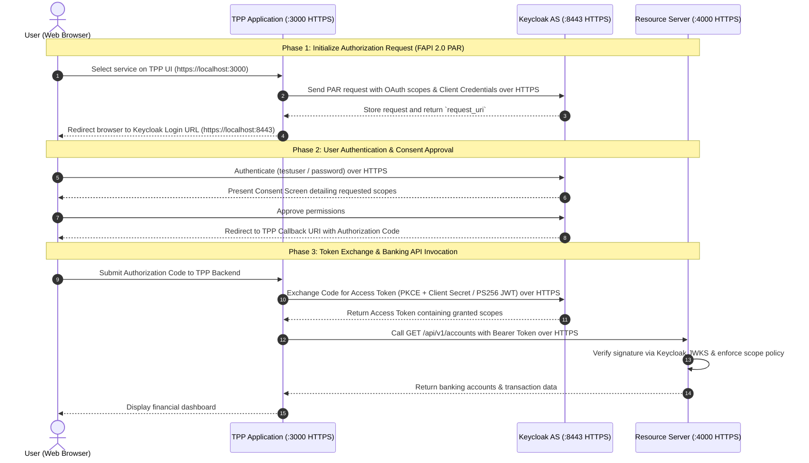

# Traditional FAPI 2.0 Open Banking Project

Traditional Open Banking authorization architecture based on **OAuth 2.0 / FAPI 2.0 (Financial-grade API)** with standard OAuth 2.0 Scopes, fully configured with strict **HTTPS / TLS encryption** for all services.

This project implements a **3-Party Centralized Architecture** without a digital wallet component, serving as a standardized reference baseline for empirical comparison against the decentralized 4-party Verifiable Credential models (`wallet-vc-model` and `wallet-vc-model-classical`).

---

> **Published ports (proxy-only).** Only the gateways publish ports: Bank `:8443` (Keycloak and the
> resource server, routed by path), TPP `:4443` / `:6443`. The Keycloak (`:8080`), resource server
> (`:4000`) and TPP (`:3000`) ports below are internal. See `evaluation/README.md`.


## 1. Component Summary & Port Mapping

| Component | Container Name | Host Port | Protocol / Technology | Primary Responsibility |
| :--- | :--- | :--- | :--- | :--- |
| **Keycloak AS** | `keycloak-fapi` | `8443` *(and `8080`)* | HTTPS / OIDC & FAPI 2.0 | Centralized authorization, session management, and User Consent screen |
| **PostgreSQL** | `postgres-fapi` | `5432` *(Internal)* | PostgreSQL 15 | Realm configuration and user database for Keycloak |
| **Resource Server** | `resource-server-fapi`| `4000` | HTTPS / Express (Node.js) | Banking API (Berka DB), FAPI signature validation & scope policy enforcement |
| **TPP App** | `tpp-fapi` | `3000` | HTTPS / Web UI & Backend | Third-Party Provider client application, initiating FAPI flows and UI |

---

## 2. Architecture & Interaction Flow (Sequence Diagram)



---

## 3. Deployment & Execution Guide

### 1. Generate TLS Certificates
```powershell
# On PowerShell:
powershell -ExecutionPolicy Bypass -File generate-certs.ps1

# Or on Bash:
bash generate-certs.sh
```

### 2. Multi-Host / VM Deployment (Optional)
To deploy across separate Virtual Machines or LAN IPs, configure `.env`:
```env
KEYCLOAK_HOST=192.168.1.10
TPP_HOST=192.168.1.20
RS_HOST=192.168.1.30
```
Then rerun `generate-certs.ps1` to embed the VM IP into the certificate SANs before launching containers.

### 3. Launch the Cluster
```bash
docker compose up -d --build
```

### 4. Default Test Accounts
- **Keycloak Admin Console**: `https://localhost:8443` (`admin` / `admin`)
- **Banking Customer**:
  - Username: `testuser` / Password: `password` (Account holder of ACC #1, ACC #2)
  - Username: `john_doe` / Password: `password`

### 5. Access Endpoints
- **TPP Application**: `https://localhost:3000`
- **Resource Server API**: `https://localhost:4000/api`
- **Keycloak Discovery**: `https://localhost:8443/realms/traditional-fapi/.well-known/openid-configuration`

---

## 4. Performance Benchmarking

To measure authorization latency and payload sizes for empirical comparison against the Wallet-VC models:
```bash
cd benchmark
npm install
npm start
```
