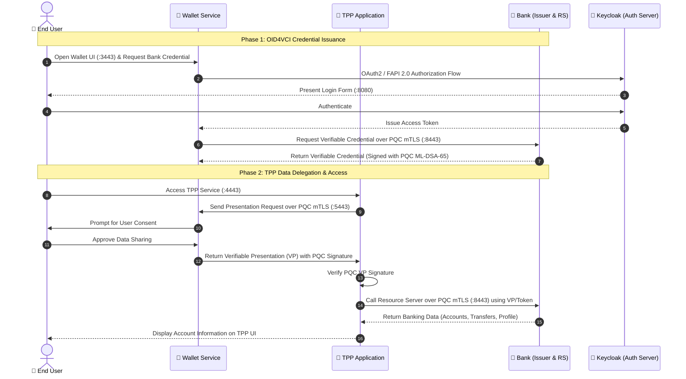

# 🛡️ Post-Quantum Cryptography (PQC) Open Banking & Verifiable Credentials Ecosystem

A distributed Open Banking ecosystem implementing **FAPI 2.0 (Financial-grade API)** and **OpenID for Verifiable Credential Issuance (OID4VCI)**, integrated with **Post-Quantum Cryptography (PQC)** algorithms to secure network communications and digital signatures against quantum computing threats.

---

> **Published ports (proxy-only).** Only the proxies publish ports; the Keycloak (`:8080`), Bank Issuer
> (`:7000`), Resource Server (`:4000`), wallet (`:5000`) and TPP (`:6001`) ports below are internal to
> their Docker networks and are no longer reachable from the host. Use Bank `:8443` (machines) / `:9443` (users),
> TPP `:4443`, wallet `:3443`. Keycloak's admin console is not published; use `docker exec`
> or a temporary compose override. See `evaluation/README.md` (published-ports table).


## 📌 Table of Contents
- [1. Architecture Overview](#1-architecture-overview)
- [2. Post-Quantum Cryptography (PQC) Highlights](#2-post-quantum-cryptography-pqc-highlights)
- [3. Components & Port Mapping](#3-components--port-mapping)
- [4. Core Business Workflows](#4-core-business-workflows)
- [5. Deployment & Quick Start](#5-deployment--quick-start)
  - [A. Single-Host Deployment (Localhost Development)](#a-single-host-deployment-localhost-development)
  - [B. Multi-Host / Multi-VM Deployment (Private LAN / IP)](#b-multi-host--multi-vm-deployment-private-lan--ip)
- [6. Environment Variables (.env)](#6-environment-variables-env)
- [7. Service Verification & Endpoints](#7-service-verification--endpoints)
- [8. Repository Structure](#8-repository-structure)

---

## 1. Architecture Overview

The system consists of three independent, loosely-coupled microservice clusters:

```mermaid
flowchart TB
    subgraph Browser[" User Web Browser "]
        UI_Wallet["Wallet Web UI\nhttps://localhost:3443"]
        UI_TPP["TPP Web UI\nhttps://localhost:4443"]
        UI_KC["Bank Login Form\nhttp://localhost:8080"]
    end

    subgraph BankCluster[" 🏦 Bank Infrastructure (pqc-bank) "]
        OQS_Bank["OQS Nginx Server Proxy\n(:8443 - PQC mTLS)"]
        KC["Keycloak Auth Server (:8080)\n+ PQC SPI Providers"]
        PG[(Postgres DB)]
        BI["Bank Issuer (:7000)\n(Spring Boot OID4VCI)"]
        RS["Resource Server (:4000)\n(Banking API)"]

        OQS_Bank -->|Reverse Proxy / HTTP| KC
        OQS_Bank -->|Reverse Proxy / HTTP| BI
        OQS_Bank -->|Reverse Proxy / HTTP| RS
        KC --> PG
    end

    subgraph WalletCluster[" 📱 Digital Wallet (pqc-wallet) "]
        W_Proxy["Nginx Web Proxy (:3443)"]
        W_Backend["Wallet Backend (:5000)\n(Spring Boot)"]
        OQS_W_Out["OQS Outbound Proxy (:18443)"]
        OQS_W_In["OQS Inbound Proxy (:5443 - PQC mTLS)"]

        W_Proxy -->|HTTP| W_Backend
        W_Backend -->|Outbound Client| OQS_W_Out
        OQS_W_In -->|Reverse Proxy| W_Backend
    end

    subgraph TPPCluster[" 🏢 Third Party Provider (pqc-tpp) "]
        TPP_Proxy["Nginx Web Proxy (:4443)"]
        TPP_Backend["TPP Backend (:6001)\n(Spring Boot)"]
        OQS_TPP_Out["OQS Outbound Proxy\n(:19443 Bank | :15443 Wallet)"]

        TPP_Proxy -->|HTTP| TPP_Backend
        TPP_Backend -->|Outbound Client| OQS_TPP_Out
    end

    %% Browser Interactions
    UI_Wallet -.->|Standard HTTPS| W_Proxy
    UI_TPP -.->|Standard HTTPS| TPP_Proxy
    UI_KC -.->|HTTP/OIDC Login| KC

    %% PQC mTLS Communications
    OQS_W_Out ==>|PQC mTLS :8443 (X25519MLKEM768)| OQS_Bank
    OQS_TPP_Out ==>|PQC mTLS :8443 (X25519MLKEM768)| OQS_Bank
    OQS_TPP_Out ==>|PQC mTLS :5443 (X25519MLKEM768)| OQS_W_In
```

---

## 2. Post-Quantum Cryptography (PQC) Highlights

1. **PQC TLS 1.3 & Mutual TLS (mTLS)**:
   - Powered by **OpenQuantumSafe (OQS) Nginx** (`openquantumsafe/nginx:latest`).
   - Hybrid Key Exchange Group: **`X25519MLKEM768`** (Combines classical X25519 ECDH with NIST-standardized Kyber/ML-KEM-768).
   - Mutual authentication (mTLS): Client certificates are validated at proxy boundaries and passed to backend microservices via secure HTTP headers.

2. **PQC Hybrid Digital Signatures**:
   - Quantum-resistant signature algorithm: **ML-DSA-65** (Dilithium3).
   - Hybrid Signature Scheme: Combines **ML-DSA-65** with **ECDSA (secp256r1 / P-384)** or **Ed25519** for Verifiable Credentials, Verifiable Presentations, and FAPI 2.0 Authorization Tokens.

3. **Keycloak Custom SPI Providers**:
   - `mldsa-provider`: Enables Keycloak to sign and verify tokens using hybrid PQC signature algorithms.
   - `pqc-x509-provider`: Custom X.509 certificate lookup SPI extracting PQC client certificates from Nginx proxy headers (`ssl-client-cert`).

---

## 3. Components & Port Mapping

| Cluster | Service | Container Port | Host Port | Description / Protocol |
| :--- | :--- | :--- | :--- | :--- |
| **Bank** | `keycloak` | 8080 | **8080** | HTTP / OIDC & FAPI 2.0 Authorization Server |
| **Bank** | `postgres` | 5432 | *(Internal)* | PostgreSQL Database for Keycloak |
| **Bank** | `bank-issuer` | 7000 | **7000** | Spring Boot - OID4VCI Credential Issuer |
| **Bank** | `resource-server` | 4000 | **4000** | Node.js - Banking API (Berka dataset) |
| **Bank** | `oqs-server-proxy` | 8443 | **8443** | OQS Nginx - Inbound PQC TLS/mTLS Gateway |
| **Wallet** | `wallet` (Backend) | 5000 | **5000** | Spring Boot - Wallet Engine & Credential Store |
| **Wallet** | `wallet-proxy` | 3443 | **3443** | Standard HTTPS - Browser UI Proxy for Wallet |
| **Wallet** | `oqs-wallet-outbound`| 18443 | *(Internal)* | Outbound PQC mTLS Forward Proxy to Bank (`:8443`) |
| **Wallet** | `oqs-wallet-inbound` | 5443 | **5443** | OQS Nginx - Inbound PQC mTLS Gateway from TPP |
| **TPP** | `tpp-java` (Backend) | 6001 | **6001** | Spring Boot - Delegation Request & VP Verifier |
| **TPP** | `tpp-proxy` | 4443 | **4443** | Standard HTTPS - Browser UI Proxy for TPP |
| **TPP** | `oqs-tpp-outbound` | 19443, 15443 | *(Internal)* | Outbound PQC mTLS Forward Proxy to Bank (`:8443`) & Wallet (`:5443`) |

---

## 4. Core Business Workflows



---

## 5. Deployment & Quick Start

### Prerequisites
- **Docker** and **Docker Compose** installed.
- **Java 17+** and **Maven** (optional, only needed if rebuilding SPI JARs from source).

---

### A. Single-Host Deployment (Localhost Development)

By default, the `.env` files in each subproject are pre-configured for single-machine local development.

1. **Start the Bank Cluster:**
   ```bash
   cd pqc-bank
   docker compose up -d --build
   ```
2. **Start the Wallet Cluster:**
   ```bash
   cd ../pqc-wallet
   docker compose up -d --build
   ```
3. **Start the TPP Cluster:**
   ```bash
   cd ../pqc-tpp
   docker compose up -d --build
   ```

---

### B. Multi-Host / Multi-VM Deployment (Private LAN / IP)

When deploying across different virtual machines or physical nodes in a private network (e.g. `192.168.1.x` or `10.0.0.x`):

1. **Bank Host (e.g., IP `192.168.1.10`):**
   Update `pqc-bank/.env`:
   ```env
   BANK_HOST_OR_IP=192.168.1.10
   ```
   Run: `docker compose up -d --build`

2. **Wallet Host (e.g., IP `192.168.1.20`):**
   Update `pqc-wallet/.env`:
   ```env
   BANK_HOST=192.168.1.10
   WALLET_HOST=192.168.1.20
   TPP_HOST=192.168.1.30
   ```
   Run: `docker compose up -d --build`

3. **TPP Host (e.g., IP `192.168.1.30`):**
   Update `pqc-tpp/.env`:
   ```env
   BANK_HOST=192.168.1.10
   WALLET_HOST=192.168.1.20
   ```
   Run: `docker compose up -d --build`

---

## 6. Environment Variables (.env)

### 1. `pqc-bank/.env`
```env
BANK_HOST_OR_IP=localhost
BANK_PORT=7000
KEYCLOAK_PORT=8080
OQS_PORT=8443
RESOURCE_SERVER_PORT=4000
```

### 2. `pqc-wallet/.env`
```env
BANK_HOST=host.docker.internal
WALLET_HOST=localhost
TPP_HOST=host.docker.internal
```

### 3. `pqc-tpp/.env`
```env
BANK_HOST=host.docker.internal
WALLET_HOST=host.docker.internal
```

---

## 7. Service Verification & Endpoints

| Service | Endpoint (Localhost) | Purpose / Description |
| :--- | :--- | :--- |
| **Keycloak Admin** | [http://localhost:8080](http://localhost:8080) | Admin Console (`admin` / `admin`) |
| **Bank Issuer Metadata** | [http://localhost:7000/.well-known/openid-credential-issuer](http://localhost:7000/.well-known/openid-credential-issuer) | OID4VCI Discovery Endpoint |
| **Bank OQS PQC mTLS** | `https://localhost:8443` | PQC TLS 1.3 (`X25519MLKEM768`) Gateway |
| **Wallet UI** | [https://localhost:3443](https://localhost:3443) | User Digital Wallet Interface |
| **TPP UI** | [https://localhost:4443](https://localhost:4443) | Third Party Provider Interface |

---

## 8. Repository Structure

```
main/
├── README.md                 # Master documentation for all 3 projects
├── pqc-bank/                 # Bank & Identity Provider Cluster
│   ├── auth_server/          # Keycloak configuration, realm configs, and SPI plugins
│   ├── bank-issuer/          # Spring Boot OID4VCI Credential Issuer
│   ├── resource-server/      # Banking Resource Server API (Node.js)
│   ├── oqs-proxy/            # OpenQuantumSafe Nginx Inbound Proxy configuration
│   └── docker-compose.yml    # Compose file for Bank cluster
├── pqc-wallet/               # Digital Wallet Cluster
│   ├── wallet-java/          # Spring Boot Wallet Backend & Crypto Engine
│   ├── nginx-proxy/          # Nginx HTTPS UI Proxy for Wallet
│   ├── oqs-proxy/            # OQS Inbound (:5443) & Outbound (:18443) Proxy configs
│   └── docker-compose.yml    # Compose file for Wallet cluster
└── pqc-tpp/                  # Third Party Provider (TPP) Cluster
    ├── tpp-java/             # Spring Boot TPP Backend & Presentation Verifier
    ├── nginx-proxy/          # Nginx HTTPS UI Proxy for TPP
    ├── oqs-proxy/            # OQS Outbound Proxy configs (:19443 & :15443)
    └── docker-compose.yml    # Compose file for TPP cluster
```
